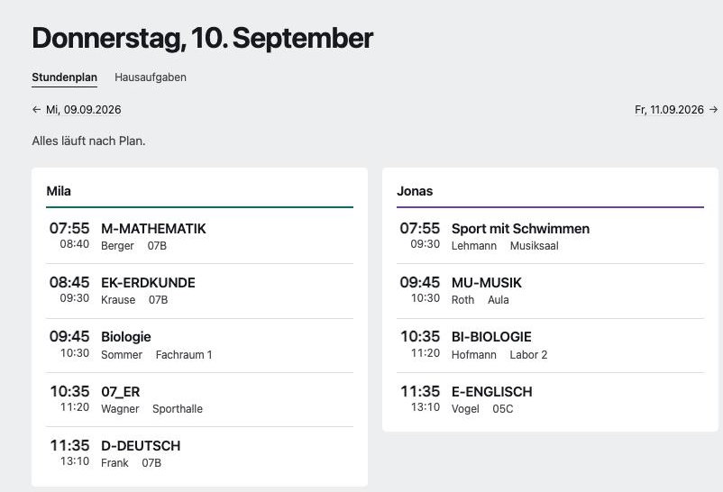
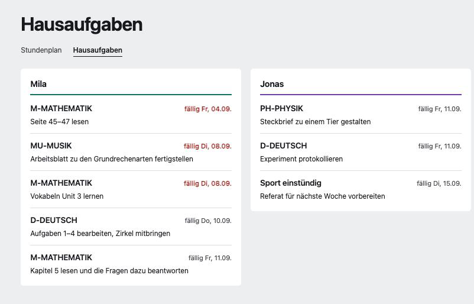

# WebUntis Dashboard

A single page showing today's WebUntis timetable for several students side by
side. Built for a phone at breakfast or a small screen in the hallway: what is
on today, and what changed.

Symfony 7, PHP-FPM, nginx. No database, no queue, no build step. The only
state - a filesystem cache, the admin-saved settings, and which homework is
ticked off - lives under `var/`.

| Timetable | Homework |
| --- | --- |
|  |  |

<sub>Screenshots use made-up names and homework.</sub>

## How it works

WebUntis exposes the JSON-RPC endpoints that the official mobile app uses.
Schools enable different login paths, so both are supported:

| Method | Endpoint | Credentials |
| --- | --- | --- |
| `secret` | `POST /WebUntis/jsonrpc_intern.do?m=getUserData2017` | username + TOTP from the app secret |
| `password` | `POST /WebUntis/jsonrpc.do` (`authenticate`) | username + password |

Prefer `secret`. It is the path the Untis app itself takes and it keeps working
at schools that have switched the classic endpoint off. The secret is a base32
string from the WebUntis profile, under access sharing, shown as a QR code. TOTP
generation is implemented in `src/Untis/Totp.php` against RFC 6238, so no OTP
library is needed.

Both paths end up with a `JSESSIONID`, which the timetable request reuses.

## Setup

```bash
composer install --no-dev --optimize-autoloader
cp config/untis.yaml.dist config/untis.yaml
```

Edit `config/untis.yaml`: the server host, the school login name from the
WebUntis URL, one account block per login, one student block per child.

Then set a real `APP_SECRET` in `.env.local` and make `var/` writable by the
PHP-FPM user:

```bash
echo "APP_SECRET=$(openssl rand -hex 16)" > .env.local
mkdir -p var && chown -R www-data:www-data var
```

### Finding the element ids

A parent account is not itself a student, so each child needs an `element_id`.
Set `setup_token` in `config/untis.yaml` and visit
`/setup/<account-id>?token=<setup_token>` once — for the example config that is
`/setup/parent?token=...`. It returns the account's own element plus every
linked child:

```json
{
  "own_element": {"element_id": 42, "element_type": 5, "display_name": "Erika Musterfrau"},
  "children": [
    {"element_id": 1234, "display_name": "Mila"},
    {"element_id": 5678, "display_name": "Jonas"}
  ]
}
```

Copy the ids into the config. If `children` is empty and the account *is* the
student, leave `element_id` out entirely and the account's own element is used.
The `raw_user_data` field is there for the cases where a school's WebUntis
version names things differently.

The `/setup` route echoes account details, so it stays locked behind
`setup_token`: any request without a matching `?token=` gets a plain 404. Clear
the token from the config to disable the route entirely.

### Changing settings without editing the config

Language, cache/refresh timing and the optional features can also be changed
from a small form at `/admin?token=<admin_token>`, set the same way as
`setup_token` above. Saves go to `var/settings.yaml`, not `config/untis.yaml`
— that file, and the credentials in it, are never written to by the app.
A saved setting wins over the matching key in `config/untis.yaml`; delete
`var/settings.yaml` (or clear `admin_token` to lock the route) to fall back
to the config file again.

## Deployment

`nginx.conf.example` is a complete vhost. Document root is `public/`, everything
routes through `index.php`, and PHP-FPM is the only moving part.

`nginx.conf.example` caches everything under `/assets/` for 7 days, so
`{{ asset(...) }}` in the templates appends each file's own mtime as a `?v=`
query string (`App\Asset\MtimeVersionStrategy`). A deploy that touches
`style.css` changes that URL, so the browser fetches it immediately instead
of serving the old file for up to a week - no manual version bump, no build
step.

The dashboard shows where two children are at any hour of the day. Put HTTP basic
auth, an IP allowlist, or your existing SSO in front of it, and serve it over
TLS only. `config/untis.yaml` holds credentials in cleartext, so it is gitignored
and should be `chmod 600` and owned by the PHP-FPM user.

## Options

| Key | Default | Effect |
| --- | --- | --- |
| `cache_ttl` | `300` | Seconds a fetched day is reused before WebUntis is asked again |
| `refresh_seconds` | `600` | Browser auto-reload interval; `0` disables it |
| `timezone` | `Europe/Berlin` | Decides which day "today" is |
| `locale` | `en` | UI language, `en` or `de` |
| `features.homework` | `true` | Homework view and its header tab |
| `features.exams` | `true` | Exams view and its header tab |
| `features.free_periods` | `true` | Free-period markers in the timetable |

Every feature defaults to on; set the ones you don't want under `features:` in
`config/untis.yaml` (see `untis.yaml.dist`), or flip them from `/admin` (see
above). A disabled `/homework` or `/exams` 404s rather than rendering empty,
the same way `/setup` does without its token, and the header only shows tabs
for the views that are enabled.

`?day=tomorrow` or `?day=2026-09-14` shows another day. The header has a pager
to the previous and next school day; Saturdays and Sundays are stepped over.

`/homework` switches to the homework list: every student's outstanding
homework, sorted by due date, read from the mobile app's
`/WebUntis/api/homeworks/lessons` endpoint. Completed assignments (as
WebUntis itself sees them) are dropped. That feed names subjects by short
code only, so the next three weeks of timetable are read alongside it to
show the same long name the timetable does ("07_WP_BI" becomes "Biologie").

Each item has a checkbox to tick it off from the dashboard; done items move
to their own page, `/homework/done`, linked from `/homework` once there is
at least one, so the everyday list does not grow long with things that no
longer need attention. This is purely local (no login needed - anyone who
can load the page can tick a box): it is stored in `var/homework-done.yaml`,
keyed by WebUntis' own id for the assignment, and never written back to
WebUntis, so the official app still shows it as outstanding. Ids that stop
showing up in a fetch (the assignment aged out of the fetch window, or a
student ticked it off for real in the official app) are pruned from that
file automatically.

`/exams` switches to the exam list: every student's exams over the next 60
days, sorted by date, read from the mobile app's `/WebUntis/api/exams`
endpoint. That endpoint filters by class rather than by student, so each
exam's assigned-student list is checked instead, and subjects are resolved to
long names the same way homework's are. All three views are linked from the
header.

The UI ships in English and German, set app-wide by `locale`. Strings live in
`translations/en.yaml` and `translations/de.yaml`.

## Home screen

The page carries a web app manifest (`/manifest.webmanifest`, a localised route)
and the Apple meta tags, so "Add to Home Screen" on a phone gives it an icon and
opens it without browser chrome. The icon is `public/icon.svg`; the PNG and ICO
sizes next to it are generated from it:

```bash
cd public
magick -background '#0F6E5C' -density 400 icon.svg -flatten -resize 180x180 -depth 8 -strip apple-touch-icon.png
magick -background '#0F6E5C' -density 400 icon.svg -flatten -resize 192x192 -depth 8 -strip icon-192.png
magick -background '#0F6E5C' -density 400 icon.svg -flatten -resize 512x512 -depth 8 -strip icon-512.png
magick -background '#0F6E5C' -density 400 icon.svg -flatten -strip -define icon:auto-resize=64,48,32,16 favicon.ico
```

The home screen label comes from `app.name` in the translation catalogues.

## Behaviour worth knowing

- Adjacent periods of the same lesson are merged, so a double period is one
  block from 08:00 to 09:30 rather than two rows. Periods more than five
  minutes apart stay separate, so real breaks survive.
- A gap of 30 minutes or more between two blocks gets its own row ("Free
  period, next lesson at 09:50"), so a day with a free period in the middle
  reads at a glance instead of requiring the reader to compare end and start
  times themselves. Shorter gaps are just ordinary passing time and stay
  silent.
- Cancelled lessons stay visible, struck through and marked. Removing them
  would hide the thing you opened the page for.
- Substitutions show the teacher who was replaced when WebUntis reports it.
- One student failing does not break the page. The error appears in that
  student's column and the other columns still render.
- The page follows the system's light/dark setting automatically. There is
  no in-app toggle; every colour is a CSS custom property, redeclared once
  for dark mode.

## Possible next steps

- An iCal feed per student for the family calendar
- Push on change: diff the cached day against a fresh fetch and send on delta

## Layout

```
src/Untis/UntisClient.php       JSON-RPC + REST calls, both login paths, normalisation
src/Untis/Totp.php              RFC 6238 tokens from the app secret
src/Untis/ConfigLoader.php      Reads config/untis.yaml, layers var/settings.yaml over it
src/Untis/TimetableProvider.php Session reuse per account, caching, error isolation
src/Untis/Lesson.php            One timetable block
src/Untis/Homework.php          One outstanding homework assignment
src/Untis/HomeworkTracker.php   Local "done" marks, layered over Homework, never synced to WebUntis
src/Untis/Exam.php              One upcoming exam
src/Asset/MtimeVersionStrategy.php      asset() cache-busting, keyed by file mtime
src/Controller/DashboardController.php  Dashboard, homework, exams, manifest, /setup helper
src/Controller/AdminController.php      /admin settings form, reads and saves via ConfigLoader
src/I18n/Translator.php         Two-language message catalogue, no framework i18n
src/Twig/I18nExtension.php      The t() Twig function
translations/{en,de}.yaml      UI strings, English and German
templates/dashboard.html.twig   The page
templates/admin.html.twig       The settings form
public/assets/style.css         The styles
public/icon.svg                 Home screen / favicon source (PNGs generated from it)
```

## Author

Sven Culley — <sven@sense-design.de> ([sense-design.de](https://sense-design.de))

MIT licensed.
